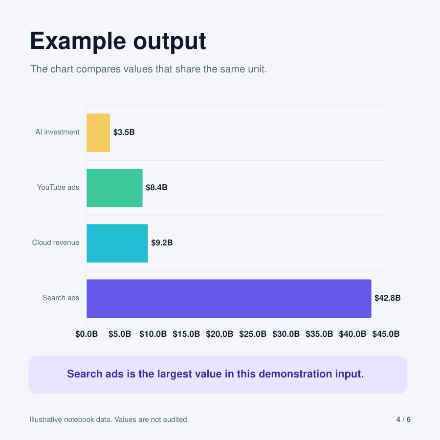
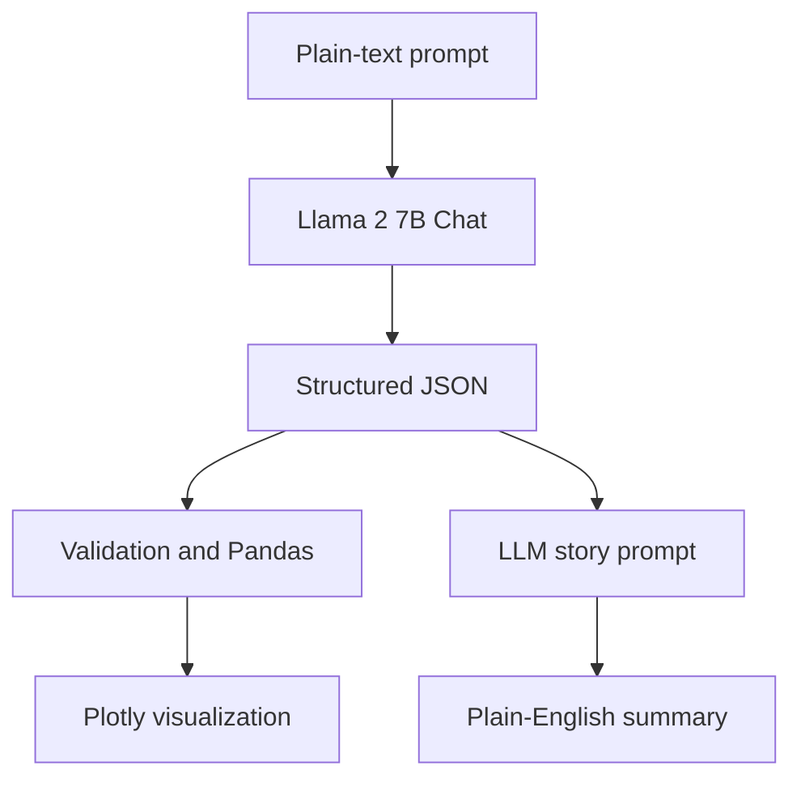

# LLM-Powered Data-to-Visual Storytelling

Turn a short business update into structured data, a clear chart, and a simple written summary using an open-weight large language model.


> This is a learning prototype. It shows how a prompt can become a useful visualization without manually building a dashboard in Power BI or Tableau.



## What the project does

You provide a short paragraph such as:

```text
Google Q2 2024 earnings:
- Search ads: $42.8B, up 11.3%
- YouTube ads: $8.4B, up 18.7%
- Cloud revenue: $9.2B, up 28.4%
- AI investment: $3.5B
```

The notebook then:

1. reads the paragraph with an LLM;
2. converts the facts into a fixed JSON format;
3. validates the numbers and loads them into a Pandas DataFrame;
4. creates a Plotly chart and writes a short, plain-English summary.

The sample values above are demonstration data supplied in the original notebook. They are not presented here as audited financial figures.

## Architecture



### A simple way to understand it

Think of the system as a small team:

- the LLM acts like a reader and finds the important facts;
- JSON works like a labelled form that keeps the facts organized;
- Pandas checks and arranges the values;
- Plotly turns the values into a chart;
- the LLM uses the checked data to explain what the chart means.

## Example structured output

```json
{
  "metrics": [
    {
      "name": "Search ads",
      "value": 42800000000,
      "period": "Q2 2024",
      "change": 11.3,
      "unit": "USD"
    },
    {
      "name": "Cloud revenue",
      "value": 9200000000,
      "period": "Q2 2024",
      "change": 28.4,
      "unit": "USD"
    }
  ],
  "entities": ["Google"]
}
```

## Technology used

| Part | Tool | Purpose |
| --- | --- | --- |
| Language model | Llama 2 7B Chat | Extracts facts and drafts the explanation |
| Model runtime | Hugging Face Transformers | Loads and runs the model |
| Memory saving | bitsandbytes 4-bit quantization | Helps the 7B model fit on a Colab T4 GPU |
| Data handling | Pandas | Validates and organizes the extracted values |
| Visualization | Plotly | Creates interactive, exportable charts |
| Environment | Google Colab | Provides a notebook and optional GPU |

The implementation follows the current Hugging Face guidance for [bitsandbytes quantization](https://huggingface.co/docs/transformers/main/en/quantization/bitsandbytes) and [chat templates](https://huggingface.co/docs/transformers/main/en/chat_templating).

## Run in Google Colab

1. Open [`notebooks/llm_data_to_visual_storytelling.ipynb`](notebooks/llm_data_to_visual_storytelling.ipynb) in Colab.
2. Select **Runtime > Change runtime type > T4 GPU**.
3. Request access to the gated [`meta-llama/Llama-2-7b-chat-hf`](https://huggingface.co/meta-llama/Llama-2-7b-chat-hf) model if you do not already have it.
4. Run the installation cell and sign in to Hugging Face when asked.
5. Run the remaining cells and replace the sample text with your own data.

The first run downloads the model, so it will take longer than later runs.

## Run locally

An NVIDIA GPU with enough memory is recommended for the included 7B model.

```bash
git clone https://github.com/YOUR_GITHUB_USERNAME/llm-data-to-visual-storytelling.git
cd llm-data-to-visual-storytelling
python -m venv .venv
source .venv/bin/activate  # Windows: .venv\Scripts\activate
pip install -r requirements.txt
jupyter lab
```

Open the notebook inside the `notebooks` folder and run its cells in order.

## Project structure

```text
llm-data-to-visual-storytelling/
├── assets/
│   ├── architecture.png
│   └── example-output.png
├── llm_data_to_visual_storytelling.ipynb
├── social/
│   ├── carousel/
│   └── LLM_Data_Storytelling_Carousel.pptx
├── output/
│   └── pdf/
│       └── LLM_Data_Storytelling_LinkedIn_Carousel.pdf
├── README.md
└── requirements.txt
```

## What was improved in the GitHub version

- replaced invalid set-based prompts with proper chat messages;
- used `BitsAndBytesConfig` for 4-bit loading;
- separated generated tokens from the original prompt;
- preserved the period stated in the input instead of using a fixed default;
- added JSON validation and clearer error messages;
- added professional chart styling and image export;
- asked the story generator to use only the extracted facts.

## Current limitations

- LLM output can still contain mistakes, so important figures must be checked.
- The included model requires Hugging Face access and works best with a GPU.
- Mixed units such as dollars and percentages should not share one chart axis.
- The project creates a single analysis on demand; it does not provide live refresh, access control, or governed company reporting.

## Possible next version

- upload CSV, Excel, or PDF files;
- select the best chart automatically from the data shape;
- add a Streamlit interface;
- support a smaller, ungated model for easier setup;
- evaluate extraction accuracy on a labelled test set;
- add source citations beside every generated insight.

## Author

**Aman Anand**  
Computer Science and Data Science

## License

This project is available under the [MIT License](LICENSE).
